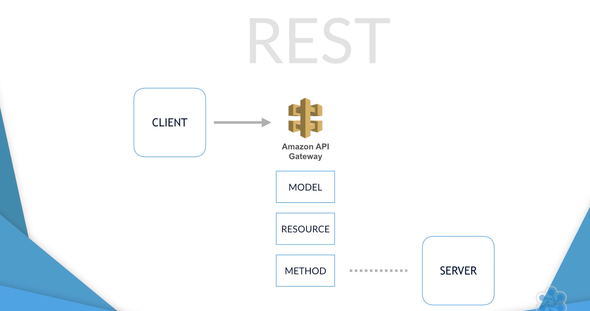

# API Gateway
AWS API Gateway is a manage service for building, deploying, and scaling various types of APIs. These may be serverless Lambda-based applications, traditional HTTP-based back-end services, or even other AWS services. We can map individual API operations such as get or put, or we can create our own methods if we want and map those to specific Lambda functions. So when you send an HTTPS:// request to the API endpoint, the Amazon API Gateway service invokes the corresponding Lambda function or Service that we have mapped to that endpoint.

