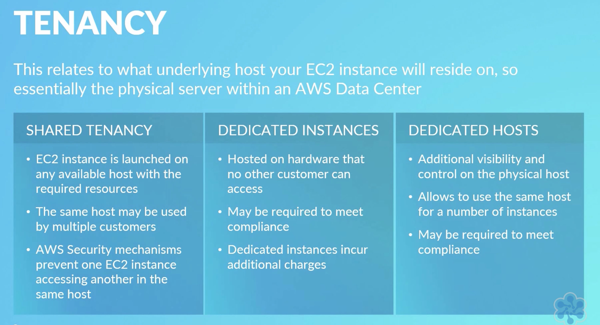

# Cloud Compute

The brains and compute as a service, RAM + CPU + Storage

# EC2

Allows you to deploy virtual servers within your AWS environment.

Can be broken down into the following 
* Amazon machine images, AMIs
* Instant types
* Instance purchasing options 
* Tenancy
* User data
* Storage options 
* Security

### Purchasing Options

* On-Demand Instances
* Reserved Instances
* Scheduled Instances
* Spot Instances
* On-Demand Capacity Reservations 

### On-Demand Instances

* Launched at any time
* Can be used for as long as needed
* Flat rate
* Typically short term usage

### Reserved Instances

The complete payment for the one or three year reservation is paid. And this offers the largest discount and no further payment is required regardless of the number of hours the instance is used. 

Partial upfront here a smaller upfront payment is made and then a discount is applied to any hours used by the instance during the term. 

No upfront no upfront or partial payments are made and the smallest discount of the three models is applied to any hours used by the instance.

Reserved instances are used for long-term predictable workloads allowing you to make full use of the cost savings to be had when using compute resources offered by EC2. 

### Scheduled Instances

### Spot Instance

- Bid for compute resources
- Not guaranteed to get it
- Bid must be higher than the spot price
- 2 min warning

### On Demand

- Reserve Capacity instance availability 

## Tenancy

## Storage Options

- Persistent storage (Attached EBS volumes)
- Ephemeral storage (Temporary on local disk)

EBS (Elastic Block Storage) volumes are separate from the EC2 instance and can be mounted at run time, logically attached via AWS. These can be attached, detached, encrypted, backed up etc.

Ephemeral is temp storage that is only lives as long as the instance is running, they cannot be removed or restored.

## Security
To connect to your EC2 instance you are required to provide a private key this created for you by AWS. They store the public key and issue you (only once) a private key. Login credentials are encrypted using the private key and 

## AMI

Machine instances are templates that allow for quick deployment of EC2 instances since they are pre-configured.

An AMI contains an image baseline, OS, applications and any pre-configuration.

# ECS (Elastic Container Service)

ECS is a service that allows you to run Docker containers/images across multiple EC2 instances without having to manage any of heavy EC2 setup and management. Using AWS Fargate the management of the underlying compute is abstracted away.

Since ECS is provided through a cluster EC2 instances security and connection is the same as EC2. These clusters is dynamically scaled and and more up or down based on usage. 

## Fargate vs EC2

Fargate ultimately is a better option if you don't need much control of the underlying host VM.

EC2 means you can control allot more of the scaling options

<image src="./pics/fargatevsec2.png">

### Monitoring

Monitoring in ECS is provided by AWS CloudWatch you can configure alarms, notification and push metrics out.

## ECR (Elastic Container Registry)

The a registry for storing images that can be deployed into ECS instances. (Dockerhub for AWS)

# EKS (Elastic Container Service for Kubernetes)

EKS is a service provided by AWS that takes care of the provisioning and running of the Kubernetes management infrastructure. 

## Kubernetes Control Plane (Managed by AWS)

There are a number of different components that make up the control plane and these include a number of different APIs, the kubelet processes and the Kubernetes Master, and these dictate how kubernetes and your clusters communicate with each other.  

The control plane schedules containers onto nodes. The term scheduling does not refer to time in this context. Scheduling, in this case, refers to the decision process of placing containers onto nodes in accordance with their declared, compute requirements.  The Control Plane also tracks the state of all kubernetes objects by continually monitoring the objects.  

**So in EKS, AWS is responsible for provisioning, scaling and managing the control plane and they do this by utilizing multiple availability zones for additional resilience.**

## Worker nodes (Managed by Users)

Kubernetes clusters are composed of nodes and the term cluster refers to the aggregate of all of the nodes.  A node is a worker machine in Kubernetes and runs as an on-demand EC2 instance and includes software to run containers managed by the Kubernetes control plane.  For each node created, a specific AMI is used which also ensures docker and kubelet in addition to the AWS IAM authenticator is installed for security controls. 

These nodes are what us as the customer are responsible for managing within EKS.  Once the worker nodes are provisioned they can then connect to EKS using an endpoint.

# Elastic Beanstalk

This is a service that allows user to provision all of the services, monitoring and scale web services in a single service.

Elastic beanstalk is free to use and has no additional costs for using the service, you only pay for the services provisioned with ES Beanstalk.

The components of ES Beanstalk:

- Application Version (The version of your code that needs to be deployed like a commit number)
- Environment (This is a reference to an application version that has been deployed, **All of the services currently deployed**)
- Environment configuration (The beanstalk configuration used be ES Beanstalk)
- Environment Tier (Web service or worker service)
- Configuration Template (The template is the baseline or creating new environment configurations)
- Platform (What programming language, operating system, server type etc)

### Environment Tier 

Web Server Environment | Web Worker Environment |
---------|----------|
 This is used for standard Web Applications that server request over 8080, 443. This will typically provision:   - Route 53   - Elastic Load Balancing   - Auto Scaling   - EC2   - Security Groups | This is used primally for background processing tasks or. This will typically provision:   - SQS Queue   -  SNS    - IAM Service Role   - Auto Scaling   - EC2   |

# AWS Lambda

AWS lambdas are serverless functions that use compute resources, in AWS lambdas you only pay for the compute worker whilst the lambda is in use. you only pay for compute power per 100 milliseconds of use only when your code is running, in addition to the number of times your code runs.

## Components of a Lambda

Lambdas as comprised of 2 main components your code or the function the lambda executes and the event source; the thing that trigger the lambda function.

Additionally Lambdas can require additional resource such as downstream resources (s3, sqs, sns etc) and Log streams (cloud watch).

# AWS Batch

AWS Batch is a service that is used to manage and run Batch computing workloads within AWS.

A batch service is made up of the following:

- Job: the task that needs to be carried out, a job is ran as a containerized application running on EC2
- Job Definition: the configuration and parameters required to run the job, what CPUs are needed, what EBS volumes are required, IAM roles etc.
- Job Queue: queued jobs are placed into a queue there can be multiple queues for different priorities
- Job Scheduler: what should a job be ran and on what environment
- Compute Environment: where will the job be ran, this can be managed or unmanaged. 

# Amazon LightSail

Amazon Lightsail is essentially a virtual private server, A VPS, backed by AWS infrastructure, LightSail is commonly used to host small websites and services.

