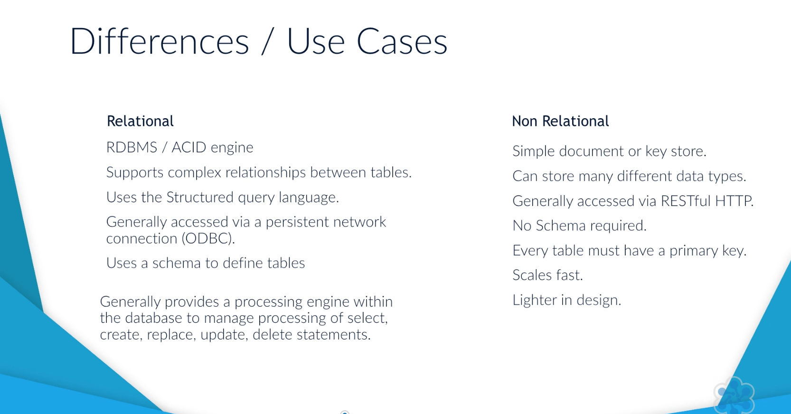
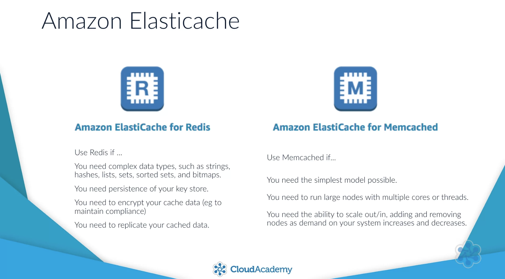
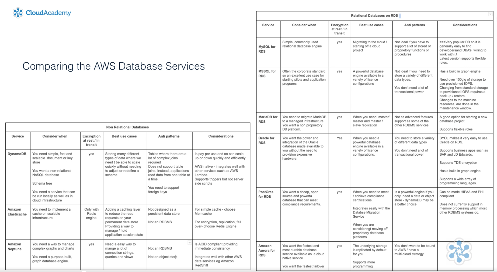

# Cloud Databases

AWS manages the underlying service/compute layer (this includes patching, installing, backups etc) you are only charged for the usage of the database and not for the setting up of that database.

Security is the responsibility of the user that owns the database.

## Amazon Relational Tables

Generally structured tables (SQL), relational tables use schema to describe tables within the database. 

A non-relational database just stores the data. A relational database stores the data and provides a processing engine. Non-relational databases suit situations where you just need a fast, secure, highly available data store which can manage many different types of objects. Relational databases suit data storage requirements where you have complex relationships between tables that might require a processing engine within the database to manage the processing of queries and updates

# NoSQL

## Amazon DynamoDB

Amazon DynamoDB is a fully managed cloud native database, and it's designed for managing high volumes of records and transactions, without you needing to provision capacity up front. It supports both document and key store objects.

## Amazon Elasticache

This is a managed cache that can be used to support Amazon RDS and Non-RDS databases by storing data that is recently accessed.

A cache is a temporary copy of frequently read data and is used to reduce the load on a database.

Elasticache comes in 2 variations of database engines: Redis and Memcache. The difference; Memcache for simplicity and speed, redis for features.

## Amazon Neptune

This is a graph database optimized for storing data relationships and querying a graph (similar to Neo4j)

## Amazon RDS

Some advantages of amazon RDS:
- The ability to scale components 
- Automatic backs and patching
- High availability (run databases in multiple AZ's)
- Automatic failover and recovery

### Amazon RDS Services

Some key SQL databases offered by Amazon as a service

- MySQL
- Microsoft SQL Server
- Oracle Database
- MariaDB
- PostgreSQL
- Amazon Aurora

### When to use Amazon RDS

- No unfront cost to create the instance
- Highly available
- Only pay for the time used

### When to use Amazon NoSQL

- Throughput scaling
- Burst scaling

## Big table of use-cases:

