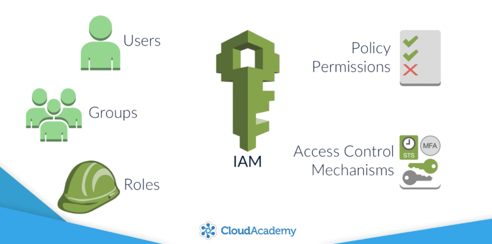
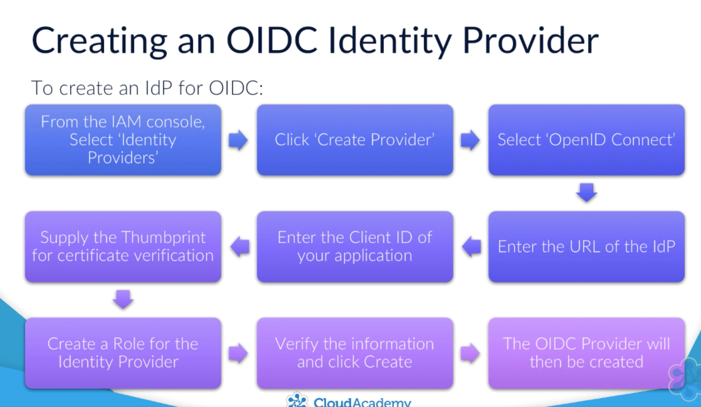
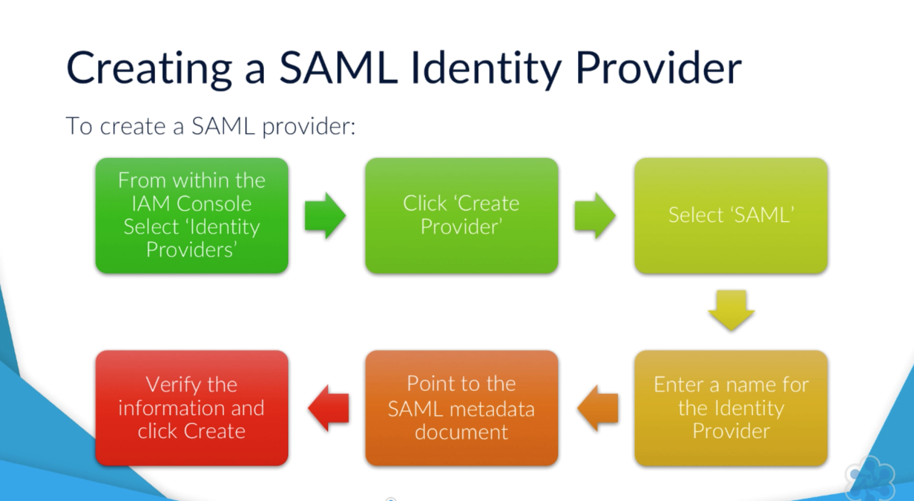

# IAM 

IAM can be defined by its ability to manage, control and govern authentication, authorization and access control mechanisms of identities to your resources within your AWS account.

Identity and Access Management:
- IAM identity management, Identities are required to authentication against AWS accounts.
- IAM access management, authorisation is a list of what an identity can access in an account. EG (S3:CreateBucket)
- Access control is a mechanism for accessing a secured resource, EG (User or group X can access S3:ReadOnly)
   

## Users

Users are objects that are created to represent an identity

## Groups

Groups are buckets of permission, user can can be added into to a group to be assigned permissions to resources

## Roles

Roles are temporary permission assigned to a service, EG An EC2 instance needs to a S3 instance but you don't want to store access and secret keys on the box you could assign a role to that EC2 instance automatically granting to access to the resource it needs without the use of keys and secrets.

Types of roles:
* AWS Service role (EC2, Lambda)
* AWS Service linked role (Predefined by Amazon)
* Cross Account access role
* Identity Provider access role

## Policies

* By Default all access is denied
* Access is only enabled with an explicit allow rule
* A Single deny rule will override any allow rule 

## Multi-factor authentication (MFA)

Using a physical or virtual device to verify a user using another form, a randomly generate number or number(s) alongside a user and password.

## Identity federation

Signing in to AWS using a trusted 3rd party such as active directory, facebook, google.

* SAML
* OPENID

## Misc

* In IAM setting a password policy can be set for all users
* Security token regions, this will allow or deny access tokens within certain regions
* Credential reports are generated every 4 hours.
* KMS key management service - rotate data encryption keys.

